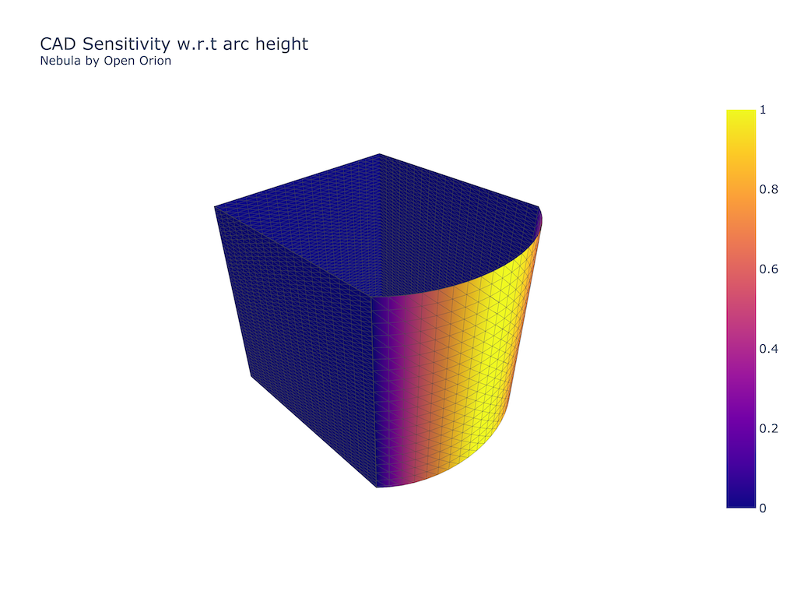

<h1 align="center">Nebula</h1>

<p align="center">open source differentiable geometry engine</p>


# About
Nebula was an attempt to create simple geometries that are auto-differentiable with respect to their design variables for design optimization and machine learning tasks. 

In the past the jacobians of geometry surface meshes with respect to the design variables were computed via finite differences, a task of altering each design variable by small epsilons and taking the position difference of their corresponding meshes. This process was very slow depending on the geometry and also restricted to just structured meshes because triangulation is very non-deterministic to small changes.

The structure of Nebula is single-to-many for performance reasons (i.e Solids with verticies and indexes rather than a list of class Solid). This allows us to construct simulataneuosly mutliple items at the same time.

The Workplane class of Nebula is modeled after CadQuery syntax for familiarity and although it has not been tested should migrate for some cases.

Nebula still has some performance issues mainly because the Jax JIT is very slow for operations that aren't uniform sized. Unfortunatly, operations like clipping and the amount of topology items are not uniform in nature so the only way to run fast would be to pad to a uniform size. This was not implemented mainly because time-deficits and the fact that the goal of this project mainly was to get CAD sensitivities.

Nebula has a lot of deficits in features and most likely has a lot of bugs so this project is for experimental use only. We will add more features as we need them as we currently don't have the resources to invest all our time to features that don't help our current roadmap.


# Install
```
pip install git+https://github.com/OpenOrion/nebula.git#egg=nebula
```


## Example 
See more examples in [examples](/examples) directory

```python
import jax
import jax.numpy as jnp
from nebula import Workplane
from nebula.render.visualization import show
from nebula.render.visualization import Tesselator

def make_mesh(height: jnp.ndarray, arc_height: jnp.ndarray):
    profile = (
        Workplane.init("XY")
        .lineTo(0, height)
        .bspline([
            (0.5, height+arc_height), 
            (1.5, height+arc_height), 
            (2, height)
        ], includeCurrent=True)
        .lineTo(2, 0)
        .close()
        .extrude(2)
    )
    return Tesselator.get_differentiable_mesh(profile)

# design varibles
height = jnp.array(2.0)
arc_height = jnp.array(0.5)

# the jacobian with respect to height and arc height i.e (0,1)
mesh_jacobian = jax.jacobian(
    lambda height, arc_height: make_mesh(height, arc_height).vertices,
    (0,1)
)(height, arc_height)
arc_height_jac_magnitude = jnp.linalg.norm(mesh_jacobian[1],  axis=-1)

# construct regular surface mesh
mesh = make_mesh(height, arc_height)

# show the mesh with magnitude of jacobian as color
show(mesh, "plot", arc_height_jac_magnitude, name="CAD Sensitivity w.r.t arc height<br><sup>Nebula by Open Orion</sup>")

```




## Current features

* Basic Sketch
    - rect
    - lineTo
    - bsplineTo
    - polarLine
    - polyline
* Extrude
* Polyline
* Bspline Operations
    - Skin
    - Evaluate


## Deficits
All the project roadmap features are in the TODO file. Main thing to keep in mind are:
* Clip operations 
    - Can only have 1-2 intersections, this was to maintain uniform size for faster operations, if we see it fit will add a workaround later


# Developement Setup
```
git clone https://github.com/OpenOrion/nebula.git
cd nebula
pip install -r requirements_dev.txt
```

# Help Wanted
Please join the [Discord](https://discord.gg/H7qRauGkQ6) for project communications and collaboration.

